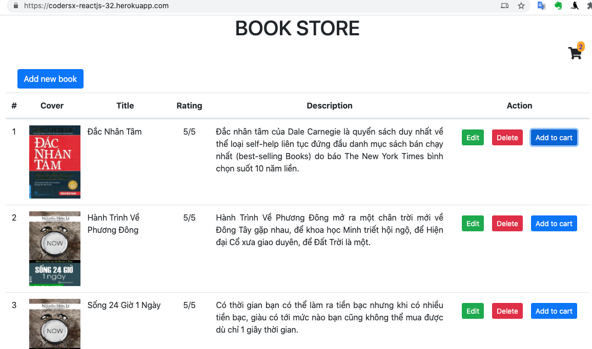

### BÀI 1 
1) Remix project cho thuê sách của bạn
2) Viết lại toàn bộ chức năng sử dụng React và các REST API endpoints đã làm
3) Sử dụng Context API để làm chức năng thêm vào giỏ khi thuê sách
==========
Link deploy
https://codersx-reactjs-32.herokuapp.com/
ScreenShot
